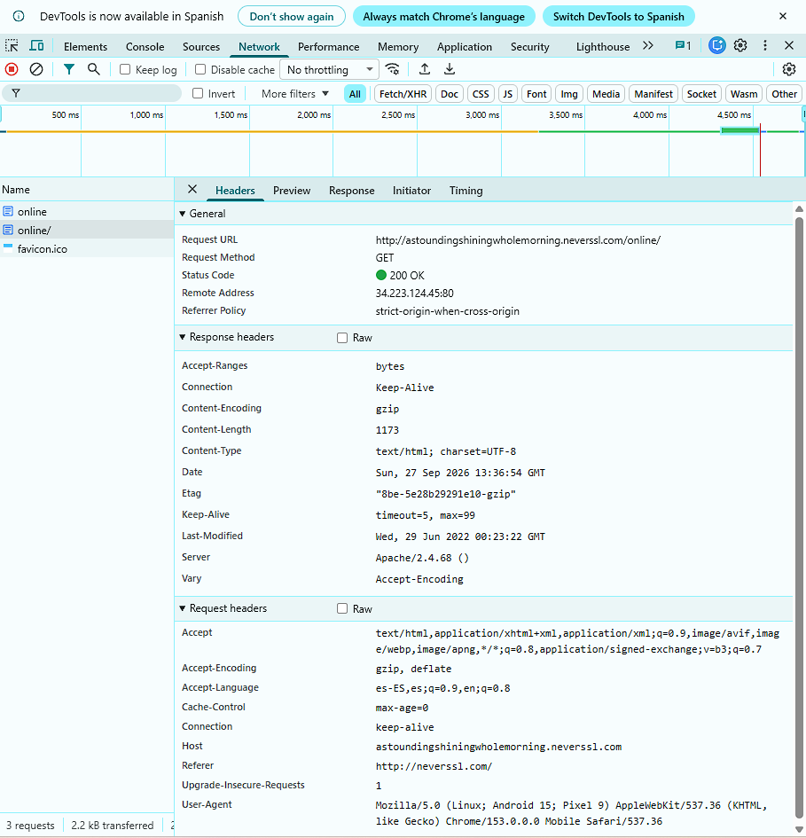

# Informe de Auditoría de Red Wi-Fi Insegura

**Repositorio:** practica-wifi-segura  
**Sitio analizado:** http://neverssl.com

## Introducción

En esta práctica se realizó un análisis básico de tráfico web utilizando las herramientas de desarrollador de Google Chrome.

El objetivo fue observar qué información puede quedar expuesta cuando se navega por un sitio que utiliza **HTTP** en lugar de **HTTPS**, especialmente cuando se utiliza una red Wi-Fi pública.

Para realizar la prueba se utilizó **NeverSSL**, un sitio diseñado para funcionar mediante HTTP y permitir observar las diferencias entre una conexión cifrada y una conexión sin cifrar.

---

## 1. ¿Qué protocolo utiliza el sitio?

El sitio analizado utiliza el protocolo **HTTP**.

Esto se puede comprobar desde **DevTools → Network → Headers**, donde la dirección solicitada comienza con:

`http://...neverssl.com/online/`

La diferencia principal es que **HTTP no cifra el contenido de la comunicación mediante TLS**, mientras que HTTPS sí utiliza cifrado para proteger la información transmitida entre el navegador y el servidor.

---

## 2. ¿Qué información puede observarse durante la solicitud?

Durante el análisis de la solicitud HTTP se pudieron observar varios datos.

Entre ellos:

- **Request Method:** GET
- **Status Code:** 200 OK
- **Host:** dominio perteneciente a neverssl.com
- **Referer:** http://neverssl.com/
- **User-Agent:** información sobre el navegador y dispositivo utilizado.
- **Accept-Language:** idiomas configurados en el navegador.
- **Connection:** keep-alive
- Otros encabezados HTTP enviados por el navegador.

### Evidencia

La captura fue obtenida desde:

**Chrome DevTools → Network → Headers**

En ella se puede observar que la solicitud utiliza HTTP y también pueden verse los diferentes encabezados enviados durante la comunicación.

### Captura de la solicitud HTTP

---

## 3. Riesgos de utilizar HTTP en una red Wi-Fi pública

El principal problema de utilizar HTTP es que la comunicación **no está protegida mediante el cifrado TLS utilizado por HTTPS**.

En una red Wi-Fi pública insegura, un atacante que consiga interceptar el tráfico podría llegar a observar información transmitida mediante HTTP.

Dependiendo del sitio y de la información enviada, podrían quedar expuestos datos como:

- Páginas y recursos HTTP solicitados.
- Encabezados HTTP.
- Información enviada mediante formularios HTTP.
- Cookies que no estén protegidas adecuadamente.
- Datos personales transmitidos sin cifrado.

Además, el tráfico HTTP podría ser modificado durante su recorrido debido a que no posee las mismas protecciones de confidencialidad e integridad que proporciona HTTPS.

Por este motivo, no deberían introducirse **contraseñas, datos bancarios o información sensible** en páginas que utilicen solamente HTTP.

---

## 4. ¿Cómo cambiaría este escenario utilizando una VPN?

Una **VPN (Virtual Private Network)** crea un túnel cifrado entre el dispositivo y el servidor VPN.

Al conectarse a una VPN, el tráfico enviado desde el dispositivo hacia el servidor VPN queda protegido mediante cifrado.

Esto resulta especialmente útil al utilizar redes Wi-Fi públicas, ya que dificulta que otras personas conectadas a la misma red puedan observar directamente el tráfico.

Una VPN proporciona:

- **Cifrado:** protege los datos entre el dispositivo y el servidor VPN.
- **Túnel seguro:** el tráfico viaja encapsulado dentro de una conexión protegida.
- **Protección del tráfico:** dificulta la interceptación desde la red Wi-Fi pública.
- **Privacidad:** reduce la información que puede observar directamente el operador de la red local.

Sin embargo, una VPN **no reemplaza HTTPS**.

Si se visita un sitio HTTP, el tráfico puede volver a estar sin cifrar desde la salida del servidor VPN hasta el servidor del sitio web.

Por este motivo, la mejor opción es utilizar **HTTPS** y, cuando sea necesario, una **VPN confiable** como protección adicional.

---

## 5. Mis 3 Reglas de Oro para navegar en redes Wi-Fi públicas

### 1. Utilizar siempre HTTPS

Antes de ingresar información sensible, verificar que el sitio utilice `https://` y una conexión segura.

### 2. Evitar operaciones sensibles

En una red Wi-Fi pública, evitar realizar operaciones bancarias, pagos o introducir contraseñas importantes cuando no sea necesario.

### 3. Utilizar una VPN confiable

Cuando sea necesario conectarse mediante una red Wi-Fi pública, utilizar una VPN confiable puede agregar una capa adicional de protección al cifrar el tráfico entre el dispositivo y el servidor VPN.

---

## Conclusión

La práctica permitió comprobar las diferencias de seguridad existentes entre **HTTP y HTTPS**.

Mediante las herramientas de desarrollador de Google Chrome fue posible identificar información como el método **GET**, el host, el User-Agent, el Referer y otros encabezados presentes en una solicitud HTTP.

En redes Wi-Fi públicas es especialmente importante utilizar **HTTPS**, evitar transmitir información sensible mediante conexiones HTTP y considerar el uso de una **VPN confiable** como protección adicional.

Estas medidas permiten reducir los riesgos relacionados con la interceptación de información al utilizar redes públicas.
